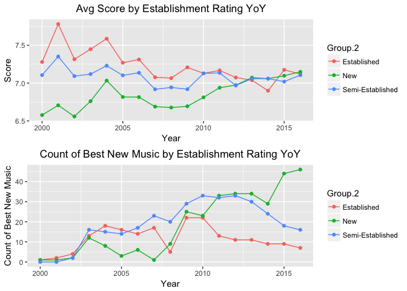

## Pitchfork Analysis Part 1

Project Overview:

Pitchfork is a music website out of Chicago, which is primarily known for their comprehensive reviews recently released music. While Pitchfork started off as an indie music publication (indie music stands for independent music, which is produced independently of commercial record label), it has morphed into an industry wide publication over the years. Critiques from Pitchfork are given in the form of a detailed evaluation, an album rating and an assigned ‘Best New Music’ award if the rating is high enough. These reviews are often considered the final word in the critique of music, however, despite shifting to an industry wide focus they’re still considered biased at times against non-indie artists. This analysis will look to examine which factors are indicative of positively (and negatively) reviewed albums and determine if Pitchfork has any noticeable biases in their critique of the music industry. 

Preliminary EDA:

The dataset utilized contains over 18,000 reviews ranging in years from 1999 to 2017. Bias can be studied by examining changes in the ratings assigned for the years from 2000 thru 2016 (which contain complete records YTD). In order to determine evidence of bias against commercial artists, artists needed to be segmented into three artist classes; Established (artists with eight or more reviews since 2000), Semi-Established (artists with four or more reviews, but less than eight, since 2000), and New (artists with less than four reviews since 2000).

The first analysis (below) of potential bias is an examination average ratings assigned and number of best new music awards given by artist class, year over year. The top panel of plot one shows that while Established artists consistently scored higher than New and Semi-Established artists throughout the 00’s, the average ratings of New artists have over taken Established artists by 2016. The bottom panel of plot one shows that while the best new music awards were distributed equally initially, the awards to New artists outpace existing artists by 650% by 2016. While average rating could provide some evidence of bias, best new music ratings are a clear indicator of bias.

<!-- -->
