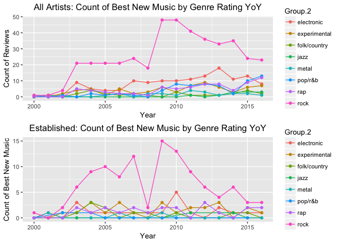
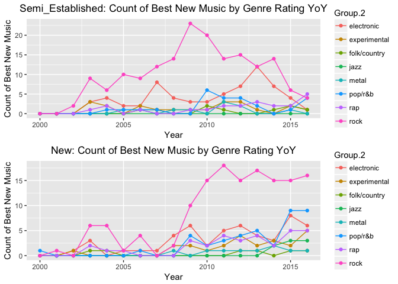

## Pitchfork Analysis: Preliminary EDA (part 2):

(continued...)

The second analysis provides a deeper dive into the distribution of the best new music awards, examining the distribution by genre and artist classes, year over year. The top panel of plot two shows the distribution of awards by genre for all artists for the period 2000 thru 20016, while the bottom three panels show the same distribution for each of the three artist classes. It’s clear that Rock genre is the dominant recipient of the best new music award overall, but the awards given by artist class are skewed. While Established and Semi-Established artists received a majority of the awards in thru the year 2010, the number of awards given after dropped off significantly, with New artists receiving a significant majority of the awards in not only Rock, but also Pop/R&B, Experimental and Rap. 

<!-- --><!-- -->
